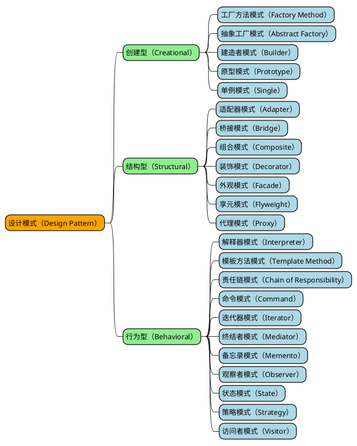

# aefawe思维导图

## 思维导图

```plantuml
@startmindmap

<style>
mindmapDiagram {
    node {
        Padding 6
        Margin 3
        RoundCorner 20
    }
    :depth(2) {
        fontSize 14
    }
}
</style>

*[#Orange] 设计模式（Design Pattern）
**[#lightgreen] 创建型（Creational）
***[#lightBlue] 工厂方法模式（Factory Method）
***[#lightBlue] 抽象工厂模式（Abstract Factory）
***[#lightBlue] 建造者模式（Builder）
***[#lightBlue] 原型模式（Prototype）
***[#lightBlue] 单例模式（Single）
**[#lightgreen] 结构型（Structural）
***[#lightBlue] 适配器模式（Adapter）
***[#lightBlue] 桥接模式（Bridge）
***[#lightBlue] 组合模式（Composite）
***[#lightBlue] 装饰模式（Decorator）
***[#lightBlue] 外观模式（Facade）
***[#lightBlue] 享元模式（Flyweight）
***[#lightBlue] 代理模式（Proxy）
**[#lightgreen] 行为型（Behavioral）
***[#lightBlue] 解释器模式（Interpreter）
***[#lightBlue] 模板方法模式（Template Method）
***[#lightBlue] 责任链模式（Chain of Responsibility）
***[#lightBlue] 命令模式（Command）
***[#lightBlue] 迭代器模式（Iterator）
***[#lightBlue] 终结者模式（Mediator）
***[#lightBlue] 备忘录模式（Memento）
***[#lightBlue] 观察者模式（Observer）
***[#lightBlue] 状态模式（State）
***[#lightBlue] 策略模式（Strategy）
***[#lightBlue] 访问者模式（Visitor）

@endmindmap
```

## 表结构